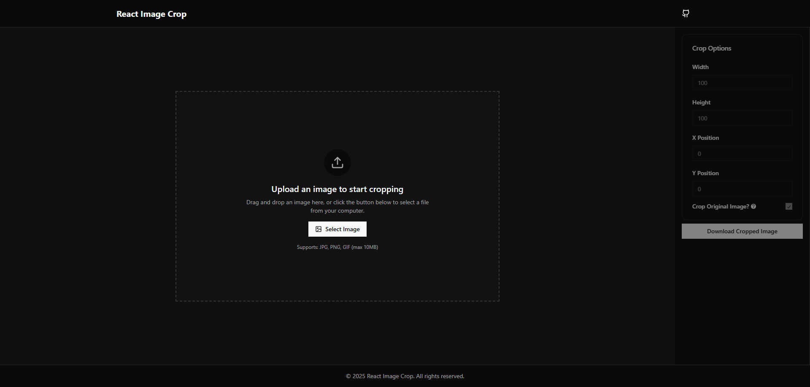

# React Image Crop Tool

A responsive and accessible image cropping tool built with React and Shadcn UI components.

 <div style="border:1px solid red;border-radius:20px;">
      
    </div>

## Table of Contents

- [Features](#features)
- [Demo](#demo)
- [Installation](#installation)

## Features

- **Responsive Design**: Adapts seamlessly to different screen sizes.
- **Drag-Drop**: An Easy and intuitive way to upload and crop images.
- **Crop Original Image**: Easily crop the original image to get the desired result.

## Demo

Check out the live demo: [react-image-crop.vercel.app](https://react-image-crop.vercel.app)

## Installation

1. Clone the repository:

   ```bash
   git clone https://github.com/islamBelabbes/react-image-crop.git
   ```

2. Navigate to the project directory:
   ```bash
   cd react-image-crop
   ```
3. Install the required dependencies:
   ```bash
   npm install
   ```
4. Start the development server:
   ```bash
   npm run dev
   ```
